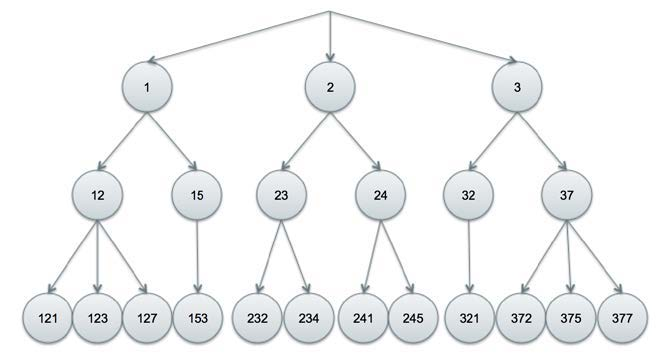
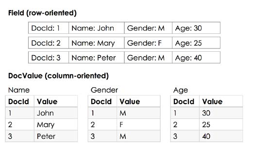

`IndexWriter` 提供创建以及管理索引的功能。

[public IndexWriter(Directory d, IndexWriterConfig conf)](https://lucene.apache.org/core/4_10_0/core/org/apache/lucene/index/IndexWriter.html#IndexWriter(org.apache.lucene.store.Directory,%20org.apache.lucene.index.IndexWriterConfig))

- [Directory]() Lucene 索引存储的位置
- [IndexWriterConfig]() 保存配置信息

**RAMDirectory** 将索引保存在内存中。

**FSDirectory** 将索引保存在文件系统中。

`FSDirectory` 有多种实现，每种实现都有各自的优缺点。大部分情况下使用 `FSDirectory.open(File path)` 让 Lucene 来选择具体的实现。


创建一个 `IndexWriter` 的步骤：

1. 定义一个 `analyzer` 来初始化 `IndexWriterConfig` 
2. 创建一个 `Directory` 来告诉 Lucene 将索引存在哪里
3. 实例化一个 `IndexWriter`

## 1.1 执行搜索

> 示例见：[LuceneTest](https://github.com/Volong/lucenedemo/blob/master/src/github/io/volong/lucenedemo/chapter01/LuceneTest.java)

执行搜索的过程如下所示：


查询字符串进入 `QueryParser.parse(String)`，通过 	`Analyzer` 将字符串变成一组 `token`。然后将 `token` 映射为 `Query` 对象，接着进入到 `IndexSearcher` 执行搜索，返回的结果为 `TopDocs` 对象。

> 注意：在索引以及搜索时使用同一个 `analyzer`，可以获得更好的搜索结果。

# 第二章 文本分析

**term** 是 Lucene 索引的基本单位。它与文档相关，包含两个属性：`field` 与 `value`。

**analyzer (分析器)**：分词与过滤处理的容器。

**tokenization (分词)**： 根据指定的分词组件定义的单词边界，将文本进行切分。

分词之后，通过过滤器过滤，将 `token` 转换为 `term`，再进行存储。

分析过程如下所示：


`Tokenizer` 使用 `Reader` 去接收字符串。它产生的有序 `token` 集，被称之为 `TokenStream`。`TokenFilter` 接收 `TokenStream` 进行过滤处理。

## 获取 TokenStream

**TokenStream** 是在分析过程中，组件之间的一种数据格式。

```java
Reader reader = new StringReader("Text to be passed");
Analyzer analyzer = new SimpleAnalyzer();
TokenStream tokenStream = analyzer.tokenStream("myField", reader);
```

## 获取 TokenAttribute 的值

用于获取 `TokenStream` 中 `token` 的值。

几种不同的 `TokenAttribute`：

-   `CharTermAttribute`：用于获取 `token` 实际的文本值。
-   `PositionIncrementAttribute`：当前 `token` 相对于上一个 `token` 的位置。默认值为 `1`。
-   `OffsetAttribute`：原文本中 `term` 的开始位置与结束位置。
-   `TypeAttribute`：用于标识数据类型。
-   `FlagsAttribute`：对特殊的 `token` 进行标识。`TokenFilter` 根据标识执行特定的动作。
-   `PayloadAttribute`：在每个索引的位置存储 `playload`，通常用于评分。

## 使用 PositionIncrementAttribute

表示当前 `token` 相对上一个 `token` 的位置。默认值为 `1`。大于 `1` 则表示两个 `token` 之间不连续，中间有一些 `token` 被隐藏了，例如停顿词等。这个属性在短语匹配时非常有用。

在同义词匹配中，同义词的位置增量 (position increment) 为 `0`，表示跟原词在同一个位置上。

## 使用 PerFieldAnalyzerWrapper

`PerFieldAnalyzerWrapper(Analyzer defaultAnalyzer, Map<String, Analyzer> fieldAnalyzers)`

构造函数接收两个参数：默认的 `analyzer`，字段与 `analyzer` 的映射。

在分析过程中，如果没有在映射关系中找到相应的字段，则会使用默认的 `analyzer`。否则使用对应的 `analyzer`。

## 自定义 TokenFilter

自定义过滤器需要继承自 `TokenFilter`，并重写 `incrementToken()` 方法。

## 自定义 Analyzer

自定义分析器需要继承自 `Anaklyzer`，并重写 `createComponents` 方法。

## 自定义 Tokenizer

自定义分词器可以选择继承 `CharTokenizer`，并重写 `isTokenChar` 方法，可以适用于绝大数的情况。

## 自定义 Attribute

自定义属性需要创建一个 `Attribute` 接口，一个继承 `AttributeImpl` 的实现类与一个继承 `TokenFilter` 的实现类。

Lucene 会去查找以 `Impl` 为后缀的 `Attribute` 实现类。

# 第三章 索引数据

文档与倒排索引的关系：


索引文件在物理被段进行分割，段的命名格式为 `segments_1`、`segments_2` 等等。

属于同一个段的文件，文件名相同，但是扩展名不同。

每一个段都是一个独立的索引，可以被单独进行搜索。

添加一个新的文件可以生成一个新的段。

索引段示例图：


`IndexReader` 会在内部对段进行合并，所以我们不需要考虑考虑索引分段的问题。

## 获取 IndexWriter

Lucene 提供了几个选项来控制索引的打开。

配置对象 `IndexWriterConfig` 用来设置 `IndexWriter`，并提供了三个 `OpenMode` 选项来打开索引。

-   **APPEND：**打开一个已经存在的索引，允许 `IndexWriter` 进行更新。不会新建索引。如果指定的索引不存在，则会抛出 `IndexNotFoundException`。
-   **CREATE：**如果索引不存在，则新建，否则进行替换。
-   **CREATE_OR_APPEND：**默认为这个选项。如果没有找到索引，则新建，否则 `IndexWriter` 在已存在的索引上进行追加。

## 创建 StringField

任何存储在这个字段中的值都会被索引，但是不会被分词，整个字符串会当作一个词。

## 创建 TextField

`TextField` 可以进行分词处理，对于存储非结构化的文本非常有用。

## 创建数值字段

Lucene 提供了四种类型的字段来存储数字。它们分别是 `IntField`、`FloatField`、`LongField`、`DoubleFiled`。

Lucene 内部将数字当作一个词来处理，通过 `trie` 树来索引它们。

如下所示：

在 `1` 的分支下，我们可以获取以 1 开头的 DocId。在 `12` 的分支下，我们可以获取以 12 开头的 DocId。假如我们要查找范围在 230 到 239 中的文档，Lucene 只需要找到 23 这个节点，然后返回它下层所有的 DocId 即可。使用这种方式可以提高 Lucene 处理数字的能力。

节点的数量可以通过 `precisionStep` 的值来进行调整。值比较小会产生大量的节点，将会消耗更多的磁盘空间，但是同时会提高范围查询的性能。该值可以在创建 `FieldType` 时进行更改。默认值为 `4`，是 Lucene 团队权衡磁盘占用与性能消耗所作出的选择。

如果你想基于数值字段进行排序，那么应该新建一个单值字段 (设置 `precisionStep` 的值为 `Integer.MAX_VALUE` 可以保证索引不会产生分支)，因为这比范围索引更加有效。

## 创建 DocValue 字段

字段的存储是面向行的，但是 `DocValue` 的存储是面向列的。在检索的时候，所有的字段信息都会跟随文档返回，所以加载文档的相关信息速度非常快。但是如果你想要对字段进行扫描，将会变得缓慢，因为你必须遍历所有的文档，在每次遍历中加载文档的字段信息。`DocValue` 按列存储 `DocId` 到值的映射，因此通过 `DocValue` 去加载文档可以很快。

字段与 `DocValue` 的存储结构差异如下所示：



Lucene 提供了如下几种 `DocValue` 类型：

-   `BinaryDocValues`：每个文档都是一个 `byte[]` 数组，用于存储自定义的数据结构。
-   `NumericDocValues`：每个文档都是单值的，数值类型的值。
-   `SortedDocValues`：每个文档都是单值的，字符串类型的值，存储与排序分离。`DocValue` 本身为 `DocId` 到`词ID` 的映射，`词ID` 引用有序词列表中的一个词。
-   `SortedNumericDocValues`：跟 `SortedDocValues` 类似，但是仅仅适用于数值。
-   `SortedSetDocValues`：跟 `SortedDocValues` 类似，但是每个文档在 `DocValues` 中都是映射一个集合而不是单个值。

## 事务提交与索引版本控制

事务的属性：**ACID** (原子性，一致性，隔离性，持久性)。

-   **原子性：**该属性要求事务要么完整，要不执行。当一个事务执行失败，事务中的任何更改都不应该存在。只有在事务完整的执行，并且提交之后，事务所做的更改才能可见。
-   **一致性：**该属性要求任何提交更改将系统从一个有效状态带到另一个有效状态。
-   **隔离性：**多个事务执行时互不干扰。
-   **持久性：**该属性要求一旦事务提交，改变就是永久的，即使是发生故障。

Lucene 支持二段提交。可以事先在 `IndexWriter` 上调用 `prepareCommit()` 最一些必要的工作 (例如，将更改刷新到磁盘上)。之后，可以调用 `commit()` 方法提交这些更改或者调用 `rollback()` 对事物进行回滚。调用 `callback()` 方法也会关闭 `IndexWriter`。调用 `commit()` 实际上内部会去调用 `prepareCommit()`。调用 `close()` 时，会在 `IndexWriter` 关闭前调用 `commit()`。

一份 Lucene 索引可能会被提交多次。每次索引的提交都可以看作当前时间点索引的一个快照。默认情况下，Lucene 使用的策略类为 `IndexDeletionPolicy`，在成功提交之后会删除之前提交的索引。为了保留之前提交的索引，你可以选择自定义一个 `IndexDeletionPolicy` 或者使用内置的 `NoDeletionPolicy`。下面是 `IndexDeletionPolicy` 中提供的一些开箱即用的策略：

-   `KeepOnlyLastCommitDeletionPolicy`：默认策略。在新的提交完成时，保留新的索引，删除之前的索引。
-   `NoDeletionPolicy`：所有的索引都将会被保留。只有在对每个索引调用了 `delete()` 才会被移除。使用该策略，可以查询之前的索引，以及维护了回滚点的集合。一个可能的场景是数据协调，当数据在数据源与索引之间不同步时，可以通过执行回滚协调。
-   `SnapshotDeletionPolicy`：在提交之后可以马上获取到快照。索引提交时的快照不能被移除，除非快照被释放了。该策略在内存中维护快照。该策略适用于对索引进行热备份。当拿到快照时，备份程序可以将索引拷贝到备份位置。
-   `PersistentSnapshotDeletionPolicy`：该策略将快照持久化到磁盘上。与索引文件在同一个文件夹中。该策略在遇到系统故障时非常有用。

## 在每个线程中重用 Document 与 Field 对象

提升 Lucene 的效率，其中最重要的一点是重用 `Document` 与 `Field` 对象。这将在导入数据时减少创建对象的消耗以及减少垃圾回收的触发。

在重用 `Document` 对象时，在设置新值之前需要清除掉所有的旧值。在重用 `Field`对象时，则直接进行设置就可以了。

## 探究 field norm

`norm` 是衡量相关性分数计算的一部分。索引期间会在每个 index field 中进行计算。
`norm` 是经过压缩的，高损耗的，存储在单字节中。这样做是为了减少存储空间，节省内存的消耗。

## 在索引期间更改相似度实现

Lucene 默认的相似度实现为 `TFIDFSimilarity`。我们可以通过继承 `Similarity` 来自定义相似度实现。

# 第三章 索引查询

## 获取 IndexReader

Lucene 提供 `IndexReader` 来获取索引某个时间点的视图。也就是说你可以并发的去写索引，但是同时你可以使用 `IndexReader` 去获取尚未提交的索引。
`IndexReader` 是一个抽象类，它有两个具体的实现：`AtomicReader` 与 `CompositeReader`。
`AtomicReader` 可以原子的读取某个索引单一的段，支持检索存储字段，docValue，term 以及文档数。
`CompositeReader` 包含多个段上的 `AtomicReader` 列表，它仅仅只支持对存储字段进行检索，其它的属性从底层的 `AtomicReader` 中合并。

## 通过 FieldCache 在内存中使用非倒排的单值字段

`FieldCache` 是内存中的数据结果，通过数组进行存储，它的值对应 `DocId`。

>   注意，一旦 `FieldCache` 被初始化，它就是静态的，非同步的数据。如果想要重新打开一个 `IndexReader`，它需要重新进行初始化。


 